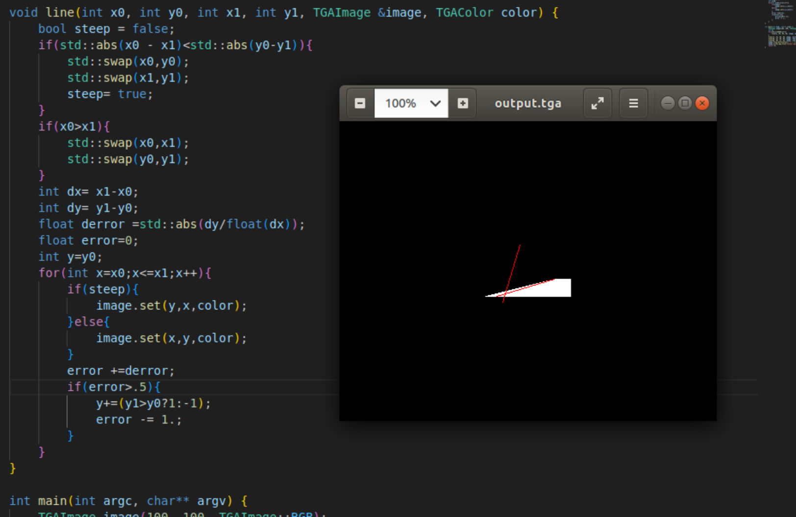

## Bresenham算法绘制线条  
  * 主要完成了一种较为优化的线段绘制  
### 1.首先来看看常规思路绘制的线段  

可以看到断点较为严重，这里主要是因为设置的精度问题，将.1改为.01看看新的效果  
  
  

可以看到效果好了很多
我们可以发现，这里只需要知道绘制多少个像素就可以了  
由此我们可以得出新的写法   
  

同时又产生了新的问题  
为什么红色线条出现了断点？  
为什么缺失了一条线    
```cpp
line(13, 20, 80, 40, image, white);
line(20, 13, 40, 80, image, red);
line(80, 40, 13, 20, image, red);  
```
### 2.改进绘制方法
* 在我的理解中，由于我们是以x为底来绘制线段，所以当x步长小于y的步长时，由于我们每次只在x的基础上绘制一个像素点，所以在垂直方向上会出现缺失的部分  

因此我们不难想到一个简单的解决方法  
即交换点来修复缺失的部分
  
可以观察到缺失不再出现了  

### 3.优化绘制速度  

我们使用g++ -ggdb -g -pg -O0 键编译了代码，然后运行 gprof  
观察到分析报告  
（这里为了更好的体现速度差异，我使用循环绘制了两千条线，基于苯人设备性能问题无法绘制更大量级）  
可以观察到只有不到10%的时间用在绘制颜色，接近80%的时间用于调用line，这就是我们的优化方向  

注意到我们绘制算法中的每个除法都具有相同的除数，因此我们可以将其从循环中取出来，并设置一个误差变量，每当误差大到一个像素，我们就将y进行调整一个像素值，同时将误差减少一  

再次调试分析报告  

可以观察到我们的优化是有效果的

* 继续设想：为什么我们需要浮点？
原因在于dx除以1并且要在循环中与0.5进行比较，很容易想到将其乘以2来规避这个浮点  


最终代码如下
```cpp
void line(int x0, int y0, int x1, int y1, TGAImage &image, TGAColor color) { 
    bool steep = false; 
    if (std::abs(x0-x1)<std::abs(y0-y1)) { 
        std::swap(x0, y0); 
        std::swap(x1, y1); 
        steep = true; 
    } 
    if (x0>x1) { 
        std::swap(x0, x1); 
        std::swap(y0, y1); 
    } 
    int dx = x1-x0; 
    int dy = y1-y0; 
    int derror2 = std::abs(dy)*2; 
    int error2 = 0; 
    int y = y0; 
    for (int x=x0; x<=x1; x++) { 
        if (steep) { 
            image.set(y, x, color); 
        } else { 
            image.set(x, y, color); 
        } 
        error2 += derror2; 
        if (error2 > dx) { 
            y += (y1>y0?1:-1); 
            error2 -= dx*2; 
        } 
    } 
} 
```
