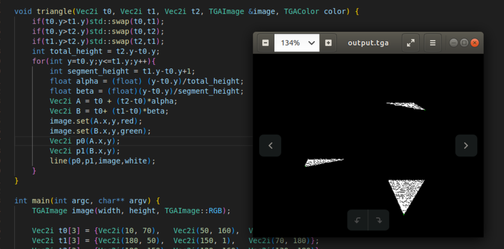

## 填充三角形  
* 主要是给三角形上色  

先看看初始的效果  

利用line画的一个简单的三角形  

为了方便操作，我们对顶点进行一个排序（按Y的大小）  


对于后续的填色操作，这里选择了对三角形进行一个水平方向的切割


这是我自己使用连线函数填充三角形的效果  
 
不知道为什么效果没有打点的好，喝了点酒头有点昏，下次想起来再研究一下  

下面是使用点来填充三角形的效果  
 
填充完整三角形↓  
  
主要方法跟划线时差不多，连接两个点就行  
整合一下代码

```
void triangle(Vec2i t0, Vec2i t1, Vec2i t2, TGAImage &image, TGAColor color) { 
    if (t0.y==t1.y && t0.y==t2.y) return; // I dont care about degenerate triangles 
    // sort the vertices, t0, t1, t2 lower−to−upper (bubblesort yay!) 
    if (t0.y>t1.y) std::swap(t0, t1); 
    if (t0.y>t2.y) std::swap(t0, t2); 
    if (t1.y>t2.y) std::swap(t1, t2); 
    int total_height = t2.y-t0.y; 
    for (int i=0; i<total_height; i++) { 
        bool second_half = i>t1.y-t0.y || t1.y==t0.y; 
        int segment_height = second_half ? t2.y-t1.y : t1.y-t0.y; 
        float alpha = (float)i/total_height; 
        float beta  = (float)(i-(second_half ? t1.y-t0.y : 0))/segment_height; // be careful: with above conditions no division by zero here 
        Vec2i A =               t0 + (t2-t0)*alpha; 
        Vec2i B = second_half ? t1 + (t2-t1)*beta : t0 + (t1-t0)*beta; 
        if (A.x>B.x) std::swap(A, B); 
        for (int j=A.x; j<=B.x; j++) { 
            image.set(j, t0.y+i, color); // attention, due to int casts t0.y+i != A.y 
        } 
    } 
}
```
### 以上是一种较为老式的行扫描方法  

观察以下代码
```
triangle(vec2 points[3]) { 
    vec2 bbox[2] = find_bounding_box(points); 
    for (each pixel in the bounding box) { 
        if (inside(points, pixel)) { 
            put_pixel(pixel); 
        } 
    } 
}
```

检查一个点是否属于一个三角形  
看着很清爽  
如果你对重心坐标有了解那你应该能很快理解到下面这个
```
#include <vector> 
#include <iostream> 
#include "geometry.h"
#include "tgaimage.h" 
 
const int width  = 200; 
const int height = 200; 
 
Vec3f barycentric(Vec2i *pts, Vec2i P) { 
    Vec3f u = Vec3f(pts[2][0]-pts[0][0], pts[1][0]-pts[0][0], pts[0][0]-P[0])^Vec3f(pts[2][1]-pts[0][1], pts[1][1]-pts[0][1], pts[0][1]-P[1]);
    /* `pts` and `P` has integer value as coordinates
       so `abs(u[2])` < 1 means `u[2]` is 0, that means
       triangle is degenerate, in this case return something with negative coordinates */
    if (std::abs(u.z)<1) return Vec3f(-1,1,1);
    return Vec3f(1.f-(u.x+u.y)/u.z, u.y/u.z, u.x/u.z); 
} 
 
void triangle(Vec2i *pts, TGAImage &image, TGAColor color) { 
    Vec2i bboxmin(image.get_width()-1,  image.get_height()-1); 
    Vec2i bboxmax(0, 0); 
    Vec2i clamp(image.get_width()-1, image.get_height()-1); 
    for (int i=0; i<3; i++) { 
        bboxmin.x = std::max(0, std::min(bboxmin.x, pts[i].x));
	bboxmin.y = std::max(0, std::min(bboxmin.y, pts[i].y));

	bboxmax.x = std::min(clamp.x, std::max(bboxmax.x, pts[i].x));
	bboxmax.y = std::min(clamp.y, std::max(bboxmax.y, pts[i].y));
    } 
    Vec2i P; 
    for (P.x=bboxmin.x; P.x<=bboxmax.x; P.x++) { 
        for (P.y=bboxmin.y; P.y<=bboxmax.y; P.y++) { 
            Vec3f bc_screen  = barycentric(pts, P); 
            if (bc_screen.x<0 || bc_screen.y<0 || bc_screen.z<0) continue; 
            image.set(P.x, P.y, color); 
        } 
    } 
} 
 
int main(int argc, char** argv) { 
    TGAImage frame(200, 200, TGAImage::RGB); 
    Vec2i pts[3] = {Vec2i(10,10), Vec2i(100, 30), Vec2i(190, 160)}; 
    triangle(pts, frame, TGAColor(255, 0, 0)); 
    frame.flip_vertically(); // to place the origin in the bottom left corner of the image 
    frame.write_tga_file("framebuffer.tga");
    return 0; 
}
```
* 计算包含三角形的边界框 bboxmin 和 bboxmax。  
遍历边界框内的每个像素 P。  
使用 barycentric 函数计算 P 的重心坐标。  
如果重心坐标中任意一个分量为负，说明 P 不在三角形内，跳过。  
否则，使用 image.set 绘制像素。  

### 接下来你就可以尝试为上次渲染的线框进行着色了
* 这里我将源代码和效果图copy过来展示

```
for (int i=0; i<model->nfaces(); i++) { 
    std::vector<int> face = model->face(i); 
    Vec2i screen_coords[3]; 
    for (int j=0; j<3; j++) { 
        Vec3f world_coords = model->vert(face[j]); 
        screen_coords[j] = Vec2i((world_coords.x+1.)*width/2., (world_coords.y+1.)*height/2.); 
    } 
    triangle(screen_coords[0], screen_coords[1], screen_coords[2], image, TGAColor(rand()%255, rand()%255, rand()%255, 255)); 
}
```

看着很头疼的一个填色


让我们来模拟光照进行一个填色  
```
Vec3f light_dir(0,0,-1); // define light_dir

for (int i=0; i<model->nfaces(); i++) { 
    std::vector<int> face = model->face(i); 
    Vec2i screen_coords[3]; 
    Vec3f world_coords[3]; 
    for (int j=0; j<3; j++) { 
        Vec3f v = model->vert(face[j]); 
        screen_coords[j] = Vec2i((v.x+1.)*width/2., (v.y+1.)*height/2.); 
        world_coords[j]  = v; 
    } 
    Vec3f n = (world_coords[2]-world_coords[0])^(world_coords[1]-world_coords[0]); 
    n.normalize(); 
    float intensity = n*light_dir; 
    if (intensity>0) { 
        triangle(screen_coords[0], screen_coords[1], screen_coords[2], image, TGAColor(intensity*255, intensity*255, intensity*255, 255)); 
    } 
}
```

了解到原理即可  