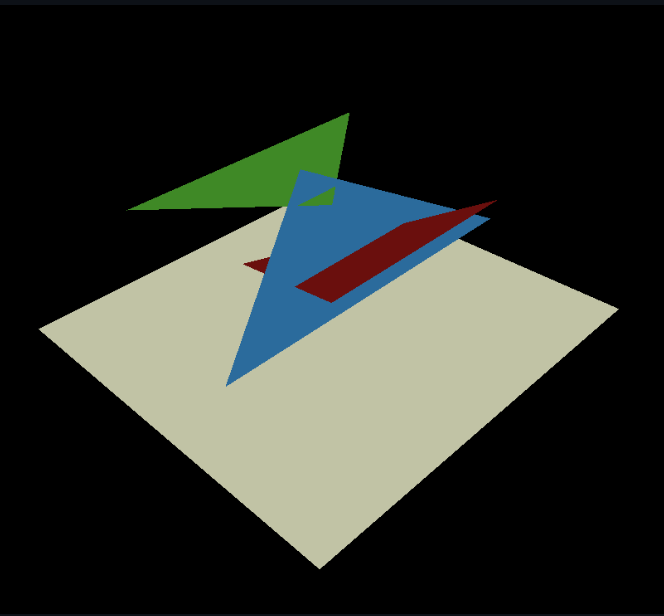

## Zbuffer
* 尝试画家算法与Zbuffer

先看看给的代码效果

发现居然已经写完了，没事我们看看原理  


需要我们处理的图

预期效果

会发现这种情况下画家算法失去作用   

直接来看代码
  
第一部分渲染出了一张侧截面的图  
第二部分则是一条像素的颜色条  
上述工作都是为了画出伪状态的3D的成像在2D面上展示  
（苯人觉得这一课的教程写的不是很明朗，可能是我看的翻译版，只能大致理解到他想做什么）  
然后给出了一个栅格化的代码
```
triangle(screen_coords, float *zbuffer, image, TGAColor(intensity*255, intensity*255, intensity*255, 255));
[...]
void triangle(Vec3f *pts, float *zbuffer, TGAImage &image, TGAColor color) {
    Vec2f bboxmin( std::numeric_limits<float>::max(),  std::numeric_limits<float>::max());
    Vec2f bboxmax(-std::numeric_limits<float>::max(), -std::numeric_limits<float>::max());
    Vec2f clamp(image.get_width()-1, image.get_height()-1);
    for (int i=0; i<3; i++) {
        for (int j=0; j<2; j++) {
            bboxmin[j] = std::max(0.f,      std::min(bboxmin[j], pts[i][j]));
            bboxmax[j] = std::min(clamp[j], std::max(bboxmax[j], pts[i][j]));
        }
    }
    Vec3f P;
    for (P.x=bboxmin.x; P.x<=bboxmax.x; P.x++) {
        for (P.y=bboxmin.y; P.y<=bboxmax.y; P.y++) {
            Vec3f bc_screen  = barycentric(pts[0], pts[1], pts[2], P);
            if (bc_screen.x<0 || bc_screen.y<0 || bc_screen.z<0) continue;
            P.z = 0;
            for (int i=0; i<3; i++) P.z += pts[i][2]*bc_screen[i];
            if (zbuffer[int(P.x+P.y*width)]<P.z) {
                zbuffer[int(P.x+P.y*width)] = P.z;
                image.set(P.x, P.y, color);
            }
        }
    }
}
```
这段代码是在上一课的基础上添加了一个Zbuffer缓冲的部分  
在遍历每一点的时候计算其深度值后进行绘制

  
  最后部分tinyrender给了一张人头渲染的效果图，有个明暗变化的，但是显然没有使用光照模型  
    
  我运行了他贴的源代码，发现源代码使用的是随机生成的颜色进行填充 
    
  于是我尝试进行一个简单的灰度插值  
  
  显然跟他的效果有不小的出入  
  能理解到他的渲染是基于一种光照与遮挡的，但我暂时还没有想到很好的方法进行渲染